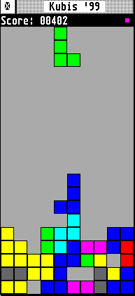

# kubis
The 90's GEM game

##
Below the original "manual" for historical purposes. Please ignore the ancient copyright statement.

~~~
KUBIS(6)                         Spiele                        KUBIS(6)

NAME
     kubis.app - das Geschicklichkeitsspiel Kubis '96

SYNOPSIS
     KUBIS.APP

BESCHREIBUNG
     Kubis '96 ist einem bekannten Geschicklichkeitsspiel nachempfunden, 
     daher kann wohl auf eine Beschreibung verzichtet werden. Die 
     Tastaturbelegung wird nach Drücken der HELP-Taste angezeigt.

DATEIEN
     kubis.app      Programmdatei (kann in kubis.acc umbenannt und als 
                    Accessory verwendet werden)

     kubis.6        Manual mit Steuersequenzen (sollte in das Verzeich-
                    nis cat6 im Manual-Ordner kopiert werden)

     kubis.txt      Manual ohne Steuersequenzen

COPYRIGHT
     Copyright (c) 30. Juli 1996
     Julian F. Reschke (jr@ms.maus.de)
     Die ursprüngliche Version von Kubis erschien im ST-Magazin (Markt & 
     Technik Verlag AG).

     Wichtiger Hinweis:

     Es wird keinerlei Haftung für irgendwelche direkten oder indirekten 
     Schäden übernommen -- einschließlich aber nicht beschränkt auf 
     materielle oder finanzielle, die durch die Benutzung dieses Pro-
     gramms oder die Untauglichkeit dieses Programms für einen bestimm-
     ten Zweck entstehen.

     Dieses Programm ist NICHT Public Domain, darf aber (ausschließlich 
     frei), weitergegeben werden. Eine Verbreitung auf PD-Sammeldisket-
     ten und ähnlichen Medien (gebührenpflichtige Mailboxsysteme, CD-
     ROMs oder `Channel Videodat') ist nur mit meiner schriftlichen 
     Genehmigung gestattet. Ich behalte mir das Recht vor, diese Geneh-
     migung jederzeit und ohne Angabe von Gründen zurückzuziehen.

     Bei der Weitergabe muß das Archiv in unveränderter Form weiterge-
     geben werden.

     Bei Gefallen und/oder regelmäßiger Benutzung bitte ich um eine 
     kleine Spende auf die Konten von Amnesty International oder Green-
     Peace.
~~~
